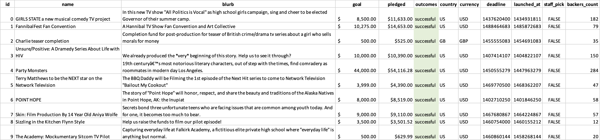
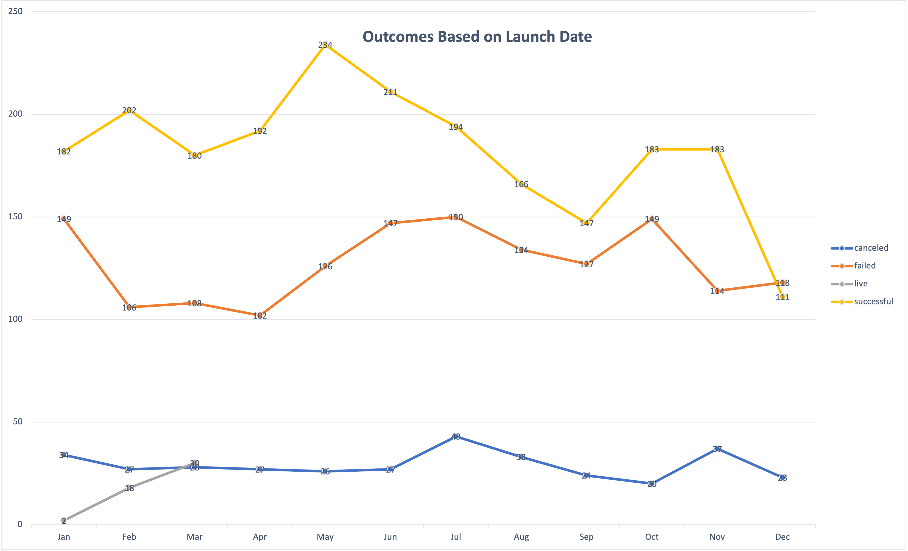
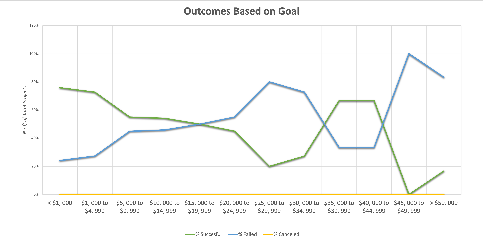

# Kickstarting with Excel

## Overview of Project

Louise, our client, is an up-and-coming playwright who is seeking to launch her first Kickstarter campaign to fund her play, *Fever*. She requires assistance in understanding the trends within such campaigns, and our group is the one assisting her, using Microsoft Excel to engage with the data.

 

### **Purpose**

The project is meant to inform you, the client, about the outcomes of theater Kickstarter projects across the globe, based on their- 1. Project's Start Date, and 2. Financial Goals. We will also provide you with recommendations formulated on the analysis.  

 

---

## Analysis and Challenges

Shown above is a small snippet of our raw data set. We've gathered data that we find relevant to your needs for approximately 4000 Kickstarters, ~1000 of which are Kickstarters for plays. 

 

### **Analysis of Outcomes Based on Launch Date**

The above data is a representation of Theater Kickstarter campaigns from 2009 to 2017. It plots the number of a specific type of campaign i.e. successful, failed, or cancelled, against the months in a year. What's clear here is that the number of successful and failed campaigns have a similar trend throughout the year, except the number of successful campaigns are much higher. And past summer, the rate of successful campaigns starts to fall off. The number of canceled campaigns are very few, and looks unrelated to the campaign launch date. 

 

### **Analysis of Outcomes Based on Goals**

The above data is a representation of the division of successful, failed, and canceled Kickstarters for plays worldwide from 2010 to 2017, based on each's funding goals. We can observe that within the ranges- '$0 to $19, 999' and '$35, 000 to $44, 999', percentage of successful projects is higher than that of failed ones. Everywhere else, the percentage of failed campaigns is the highest. However, past $50, 000 the graphs of successful and failed campaigns are on the path to converge. None of the Kickstarters for plays were cancled.

 

### **Challenges and Difficulties Encountered**

While we didn't run into any challenges, it is worth noting that the analysis can be more informative. There is an unusual trend in the outcomes of campaigns based on their financial goals; we think they can be better understood by studying the specifics of the funding itself, i.e., average donation, count of backers, etc.

 

---

## Results

### **Conclusions**

We recommend that you choose to launch the Kickstarter in the Spring or before the end of Summer; the highest likelihood of success would be in May. Avoid launching it in the Fall and Winter, especially in December. Your chances of successfully funding a Kickstarter will be high if you limit the funding to $5, 000. We understand that you were estimating a budget over $10, 000, so if you're willing to take a higher risk, make sure to avoid going over $15, 000. 

 

### **Limitations**

As mentioned before, one of the limitations of our analysis is the lack of specificities in the 'Outcomes Based on Goal Chart.' Another limitation is that for the scope of your area, the 'Theater Outcomes' may be a bit broad. We could narrow down the outcomes to only Plays to see if there are any different insights if you'd like.

 

### **Other Possibilities**

The data for the Theater outcomes could be expressed in percentages. Alongside the launch date of the Kickstarter, it may also be valuable to look at data on the duration of the Kickstarter. And lastly, I would also consider the comments we've made in the previous sections. 